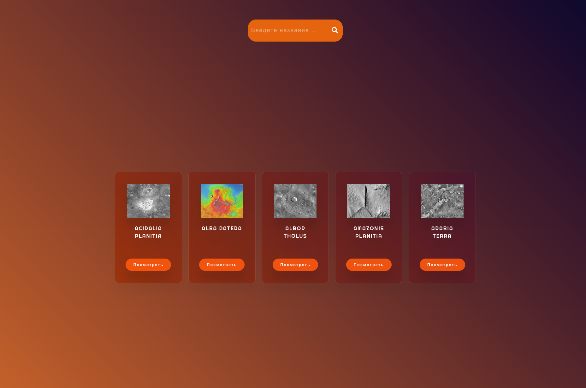
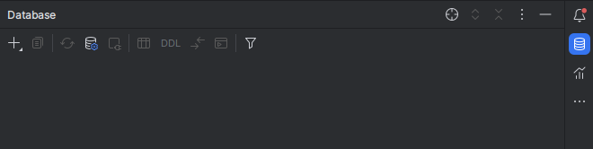

## Разработка Интернет Приложений

### Предметная область "Станции на поверхности Марса"

Описание лабораторной работы

- **Цель работы**: выбор варианта-темы на весь курс, знакомство с разработкой бэкенда и разработка дизайна для 2 страниц
- **Порядок показа**: показать две страницы приложения, объяснить заголовки во вкладке `Network`, объяснить шаблоны, контроллеры этих страниц и коллекцию данных
- **Контрольные вопросы**: MVC, Django/Go, шаблонизация, HTTP, Web, HTML
- **Задание**: Базовая шаблонизация в Django (для Go просто HTML) для `услуг`, создание дизайна приложения

Создание базового интерфейса, состоящего из двух страниц. Первая для просмотра списка `услуг` (отели, товары, рейсы и
тд) в виде карточек с наименованием, ценой и картинкой. При клике по карточке происходит переход на вторую страницу с
подробной информацией об `услуге` (даты, описание и тд)

В приложении должны быть использованы стили, для каждого элемента списка подгружается свое изображение. Разработать
стиль приложения, который будет применяться далее в последующих лабораторных по фронтенду. `CSS` вынести в отдельный
файл. Все данные для обеих страниц нужно брать прямо из коллекции, без использования БД.

Добавить поле input для фильтрации на сервере списка `услуг` по одному из полей (наименование, цена), отображаемых на
странице (по умолчанию отображать все). Поле поиска должно сохраняться после запроса. Всего в приложении должно быть 2
GET запроса и одна модель-коллекция. Без `JavaScript`

* [Инструкция по работе c Python](/tutorials/python/python.md)
* [Методические указания Django](/tutorials/lab1-py/lab1_tutorial.md)
* [Методические указания Golang](/tutorials/lab1-go/README.md)

Вид базового интерфейса

- Главное меню

- Список географических объектов (услуг)

- Детальная информация о географическом объекте

