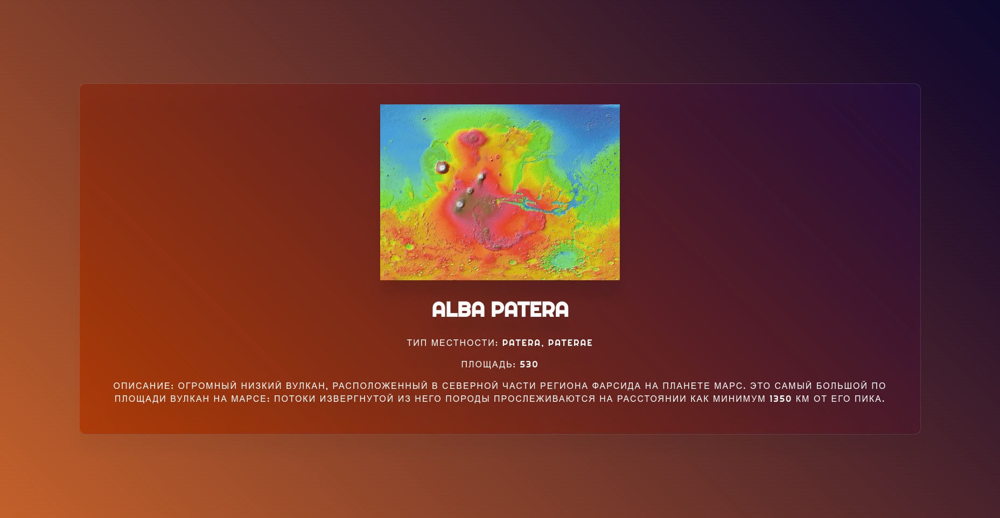

## Разработка Интернет Приложений

### Предметная область "Станции на поверхности Марса"

<details style="font-size: 14px;">
<summary>
<span style="font-size: 16px; font-weight: bold;">Описание лабораторной работы</span>
</summary>

- **Цель работы**: разработка структуры базы данных и ее подключение к бэкенду
- **Порядок показа**: показать панель администратора/adminer, добавить запись, посмотреть данные через select в БД,
  показать шаблоны страниц. Объяснить модели, контроллеры для созданных таблиц
- **Контрольные вопросы**: ORM, SQL, модель и миграции
- **ER диаграмма**: сделать в StarUML; таблицы, связи, столбцы, типы столбцов и их длина, первичные, внешние ключи
- **Задание**: Создание базы данных `PostgreSQL` по теме работы, подключение к созданному шаблонизатору

Необходимо разработать структуру БД по выбранной теме и ее реализовать с учетом требований ниже. Использовать
таблицу `услуг` в страницах разработанного приложения. Наполнить таблицы БД данными через `админку Django`
или `Adminer`. Получение `услуг`, поиск и фильтрацию удаленных записей сделать через `ORM`.

Для карточек таблицы `услуг` добавить кнопку логического удаления услуги (через статус) с помощью выполнения SQL запроса
без ORM.

**Требования к БД**:

Обязательно наличие 4 таблицы: `услуг` (статус удален/действует, изображение), `заявок` (статус, дата создания datetime,
дата формирования datetime, дата завершения datetime, `создатель` и `модератор`), `м-м заявки-услуги` (составной
первичный ключ), `пользователей`

Обязательно наличие 5 или более статусов `заявок`: черновик, удалён, сформирован, завершён, отклонён. Названия таблиц и
их полей должны соответствовать предметной области.

* [Методические указания PostgreSQL](/tutorials/lab2-db/README.md)
* [Методические указания Django](/tutorials/lab2-py/lab2_tutorial.md)
* [Методические указания Golang](/tutorials/lab2-go/README.md)
* [Курс по основам БД](https://aiintro.docs.iu5edu.ru/docs/db/)

</details>


<details style="font-size: 14px;">
<summary>
<span style="font-size: 16px; font-weight: bold;">Инструкция по запуску и подключения к БД</span>
</summary>

1. Необходимо сначала создать базу данных или подключить к существующей БД, например, `postgres`
2. Создать БД в командной строкой:
```bash
sudo -u postgres psql
```
3. В интерактивную оболочку PostgreSQL. Создайте новую базу данных командой:
```postgresql
CREATE DATABASE имя_базы_данных;
```
4. Выйти с БД:
```postgresql
\q
```


5. Переключить на созданную БД:

```postgresql
\c имя_базы_данных;
```

6. Посмотреть список таблиц и отношения:

```postgresql
\dt имя_базы_данных;
```

7. Нужно зайти в панель БД (справа) для подключения


8. Зайти в свойства и создать подключение к БД.


9. Заполнить данные и проверить соединение `Test Connection`. Если есть соединение, то нажимаем на кнопку `ОК`.


10. Теперь в `setting.py` нужно указать название БД как:
```python
DATABASES = {
    "default": {
        "ENGINE": "django.db.backends.postgresql",
        "NAME": "mars_lab2",
        'USER': 'postgres',
        'PASSWORD': 'postgres',
        'HOST': 'localhost',
        'PORT': 5432,  # Стандартный порт PostgreSQL
    }
}
```
10. Теперь нужно зайти в файл `database.sql` и выполнить все запросы.
```text
-- Географические объекты
CREATE TABLE geographical_object
(
    id       SERIAL PRIMARY KEY,
    feature  VARCHAR NOT NULL,
    type     VA
...
...
...
```
11. После выполнения данные обновится


12. Необходимо сделать миграцию данных
```bash
python manage.py migrate
```
</details>

<details style="font-size: 14px;">
<summary>
<span style="font-size: 16px; font-weight: bold;">Создание суперпользователя и панель администратора</span>
</summary>

1. После подключения к БД и миграции можно создать суперпользователя:
```bash
python manage.py createsuperuser
```
Пусть username будет `redalexdad`, а пароль `123456789`


2. По ссылке заходим: http://127.0.0.1:8000/admin/ и вводим данные
3. После ввода появится панель администратора.


</details>